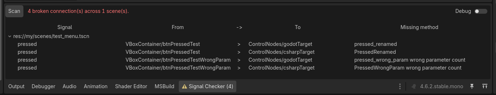

# Godot Signal Checker

Checks scenes for broken signals / events connected via the the Godot signal tab.  

## The Problem

Godot complains about broken signals connected from code, but **editor-connected signals fail silently**, when you rename or delete the receiver method.  
You usually find out the hard way, a button click that does nothing, or worse, a bug report from a player.

This should be a temporary solution until the GitHub issue [godot-proposals#8982](https://github.com/godotengine/godot-proposals/issues/8982) solves the problem in-engine.

## Features

* Scans your scenes for missing signals
* Supports GDscript and C#
* Disable parameter scans
* Purely written in GDscript for maximal compatibility
* Print results to console for easier sharing

## Screenshots

## Setup

Either use the Godot assed library to install it or manually copy the `addons/GodotSignalChecker` into your addons folder and enable it in `Project` -> `Project Settings` -> `Plugins`.

## Use

When opening the project or enabling the plugin an initial scan will be performed.  
Other than that there is currently no auto-reload system, switch to the "Signal Checker" tab at the bottom and press the `Scan` button.  

## Issues

It is not clear if this the parameter count works correctly, eg. build in Godot functions in C# (there are a lot of warnings about that and snake case), so you can deactivate it.  

## TODO

* Check method parameter types  

## Contribute
Please try to adhere to the GDScript style guidelines [https://docs.godotengine.org/en/stable/tutorials/scripting/gdscript/gdscript_styleguide.html](https://store.godotengine.org/asset/spielmannspiel/godot-signal-checker/).  
States that are considered "stable" enough will get a git-tag and be released to the Godot Asset Library.  

## OTHER

Godot Asset Library (new): [https://store.godotengine.org/asset/spielmannspiel/godot-signal-checker/](https://store.godotengine.org/asset/spielmannspiel/godot-signal-checker/)  
Godot Asset Library (old): [https://godotengine.org/asset-library/asset/5122](https://store.godotengine.org/asset/spielmannspiel/godot-signal-checker/)  
GitHub: [https://github.com/SpielmannSpiel/GodotSignalChecker](https://store.godotengine.org/asset/spielmannspiel/godot-signal-checker/)  
by bison - SpielmannSpiel [https://spielmannspiel.com](https://store.godotengine.org/asset/spielmannspiel/godot-signal-checker/)  
